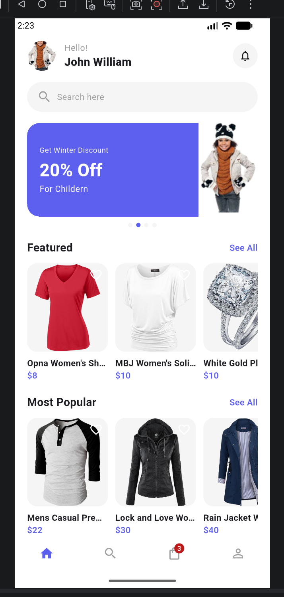
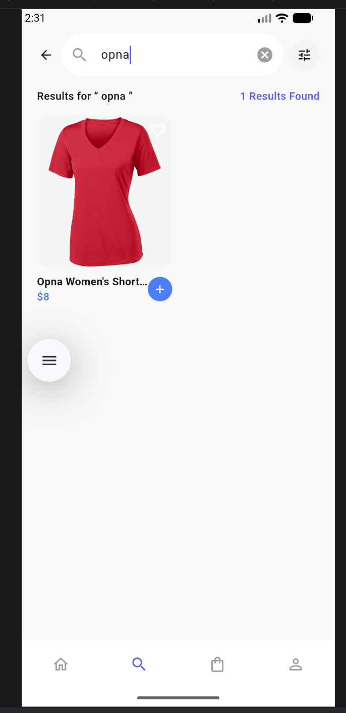
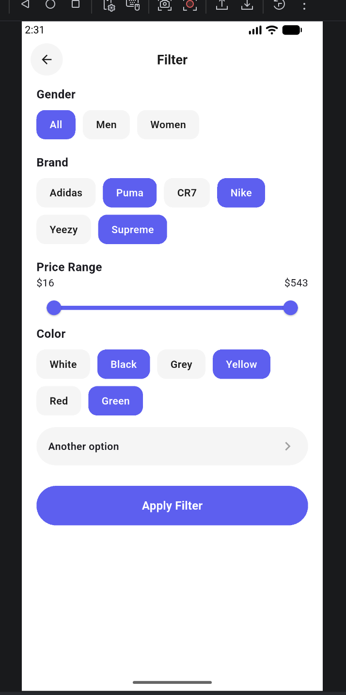
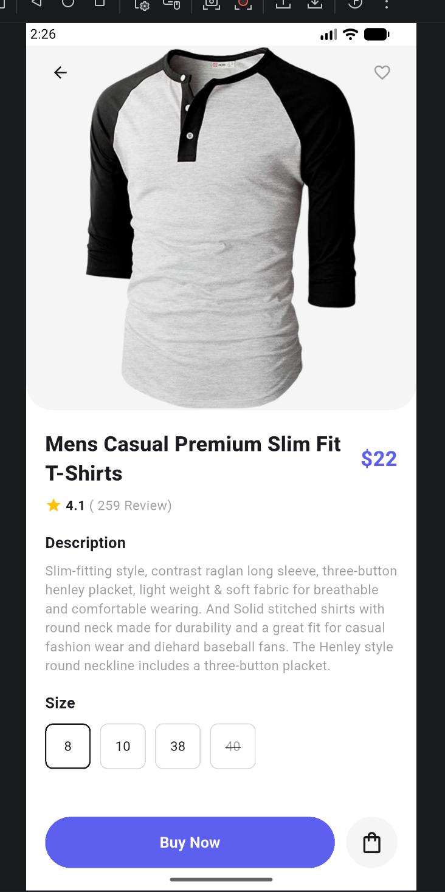
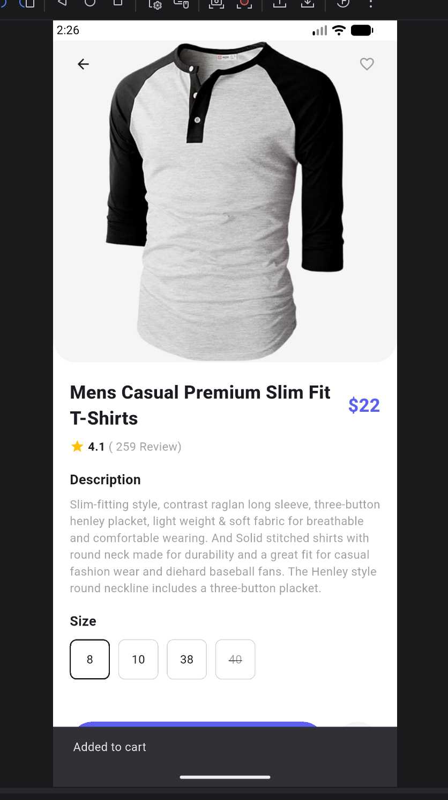
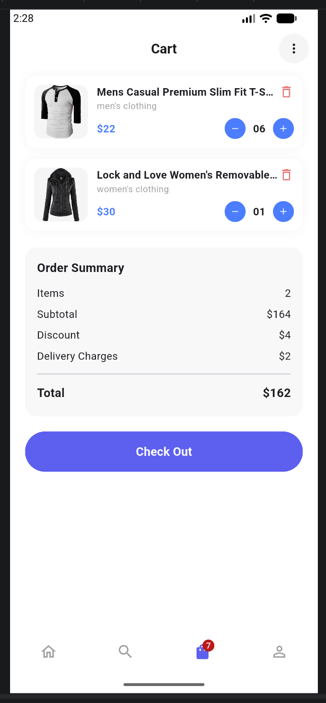
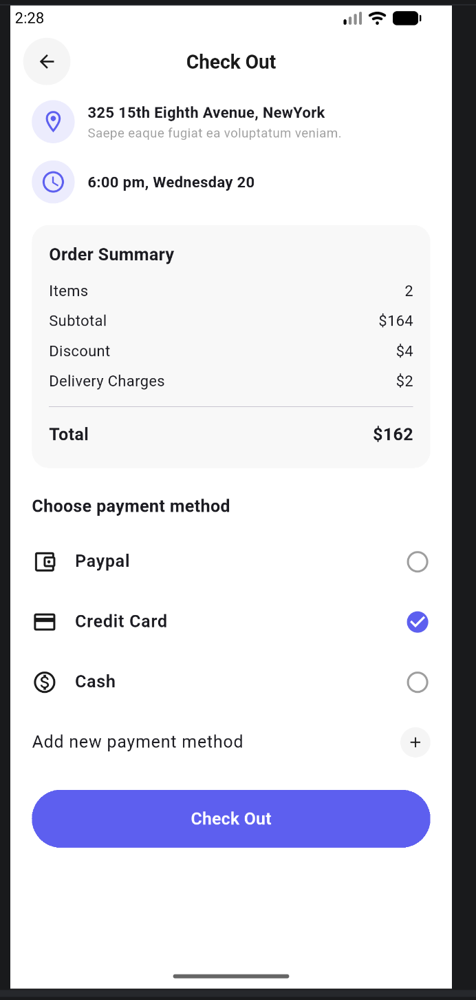
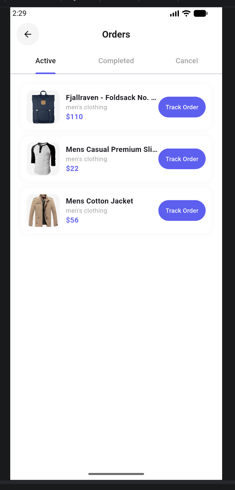
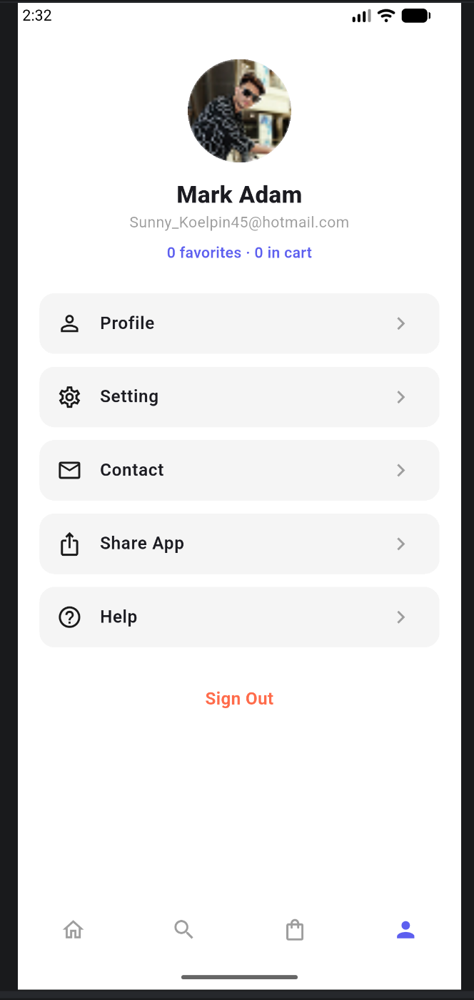
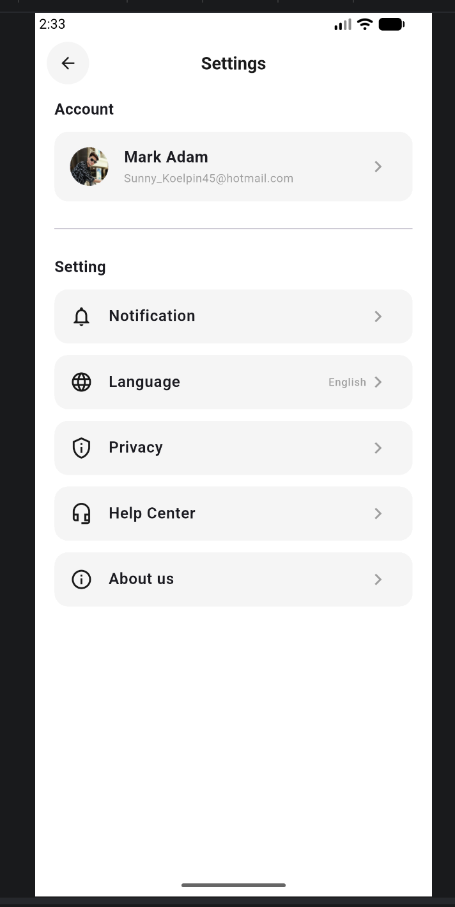

# Shop Hub

Flutter e-commerce app for the **State Management avec Riverpod** course.

Catalog data comes from [FakeStoreAPI](https://fakestoreapi.com). Local favorites use `shared_preferences`. Navigation uses `go_router` with a bottom shell.

**Stack:** Flutter 3 · Riverpod 2 · go_router · http · shared_preferences · cached_network_image

**CI:** GitHub Actions runs `flutter analyze` + `flutter test` on every push/PR (see `.github/workflows/ci.yml`).

---

## Course requirements checklist

| Requirement | Implementation |
|-------------|----------------|
| ≥ 5 distinct Riverpod providers | 12+ providers under `lib/providers/` |
| `AsyncValue` for async data | `FutureProvider` + `LoadingErrorView<T>` (`.when`) on home, catalog, search, detail, favorites, orders, categories |
| Favorites persisted locally | `FavoritesLocalDatasource` ↔ `FavoritesNotifier.loadFromLocalStorage` / `toggleFavorite` → `save` |
| Filtering & sorting | `ProductFilterService` + `filteredProductsProvider` (category ∩ search ∩ sort) |
| User profile (mock) | `UserProfile` model + `userProfileProvider` → `ProfileScreen` / `SettingsScreen` |
| Layered architecture | `screens` → `providers` → `data` / `services` → API or local storage |
| Tests | Unit + widget tests in `test/` |
| CI/CD | `.github/workflows/ci.yml` |

---

## Design goals

| Goal | How it shows up in code |
|------|-------------------------|
| No spaghetti | UI never calls HTTP or SharedPreferences |
| Thin providers | Filter/sort logic lives in `ProductFilterService` (pure), not in UI |
| Thin screens | Screens `watch` / `read` providers and compose widgets |
| Immutable state | Cart & favorites always assign a **new** list/set |
| Testable I/O | `ProductRepository(client:)`, `FavoritesLocalDatasource(prefs:)` |

---

## Architecture

```
lib/
  main.dart                 ProviderScope + MaterialApp.router
  models/                   Product, CartItem, SortOption, UserProfile
  data/                     ProductRepository, FavoritesLocalDatasource, exceptions
  services/                 ProductFilterService (pure filter/sort)
  providers/                Riverpod providers only (no widgets)
  screens/                  Route pages — layout + navigation
  widgets/                  Reusable UI (incl. LoadingErrorView<T>)
  router/                   go_router shell + stacked routes
  theme/                    AppColors + AppTheme
```

**Data flow**

```
Screen / Widget
      │  ref.watch / ref.read
      ▼
Provider (Riverpod)
      │
      ├──► ProductRepository ──► FakeStoreAPI
      ├──► ProductFilterService (pure, sync)
      └──► FavoritesLocalDatasource ──► shared_preferences
```

**Rules**

1. Providers own orchestration (combine async data + UI state).
2. Repositories / datasources own I/O.
3. Services own pure domain logic (filter/sort).
4. Screens own layout and navigation only.

---

## Providers reference

| Provider | Type | Role |
|----------|------|------|
| `productRepositoryProvider` | `Provider` | Injectable `ProductRepository` |
| `productsProvider` | `FutureProvider` | Full catalog (`AsyncValue`) |
| `categoriesProvider` | `FutureProvider` | Categories (`AsyncValue`) |
| `productByIdProvider` | `FutureProvider.family` | One product (`AsyncValue`) — detail screen |
| `categoryFilterProvider` | `StateProvider` | Selected category (`null` = all) |
| `sortOptionProvider` | `StateProvider` | Price asc/desc, name A–Z |
| `searchQueryProvider` | `StateProvider` | Search text |
| `filteredProductsProvider` | `Provider` | Catalog ∩ category ∩ search ∩ sort as `AsyncValue` |
| `activeFiltersSummaryProvider` | `Provider` | Debug / chip summary string |
| `cartProvider` | `StateNotifierProvider` | Cart add/remove/qty/clear/total |
| `favoritesProvider` | `StateNotifierProvider` | Favorite ids + **local persist** |
| `favoritesLocalDatasourceProvider` | `Provider` | Datasource injection |
| `userProfileProvider` | `Provider` | Mock profile for Profile/Settings |
| `paymentMethodProvider` | `StateProvider` | Checkout payment selection |
| `filterGenderProvider` / brands / colors / price | `StateProvider` | Filter UI draft state |

---

## Favorites persistence (local)

```
App start
  └─ FavoritesNotifier()
       └─ loadFromLocalStorage()
            └─ FavoritesLocalDatasource.load()  → SharedPreferences

User taps heart
  └─ toggleFavorite(id)
       ├─ state = new immutable Set
       └─ FavoritesLocalDatasource.save(state)  → SharedPreferences
```

Covered by `test/favorites_provider_test.dart` with `SharedPreferences.setMockInitialValues`.

---

## Filtering & sorting

`filteredProductsProvider` watches four sources and delegates to `ProductFilterService.apply`:

1. `productsProvider` (async list)
2. `categoryFilterProvider`
3. `searchQueryProvider` (title / category / description)
4. `sortOptionProvider`

Unit-tested in `test/product_filter_service_test.dart`.

---

## AsyncValue usage

Every async screen uses `LoadingErrorView<T>`:

```dart
final AsyncValue<Product> productAsync =
    ref.watch(productByIdProvider(widget.productId));

LoadingErrorView<Product>(
  value: productAsync,
  onRetry: () => ref.invalidate(productByIdProvider(widget.productId)),
  builder: (product) => ProductDetailBody(...),
);
```

Branches: **loading** (spinner) · **error** (message + Retry) · **data** (builder).

Errors from the repository are typed: `NetworkException`, `ApiException`, `ParseException`.

---

## Navigation (`go_router`)

**Bottom shell:** `/home` · `/search` · `/cart` · `/profile`

**Stacked:** `/products` · `/product/:id` · `/favorites` · `/checkout` · `/orders` · `/filter` · `/settings`

Cart badge = `cartProvider.notifier.itemCount` in `ShellScaffold`.

---

## Screenshots

| Screen | Capture |
|--------|---------|
| Home |  |
| Search |  |
| Filter |  |
| Product detail |  |
| Add to cart |  |
| Cart |  |
| Checkout |  |
| Order history |  |
| Profile (mock) |  |
| Settings |  |

---

## Setup

```bash
flutter pub get
flutter run
```

```bash
# Quality gates (same as CI)
flutter analyze
flutter test
```

Requires Flutter 3.x and network access to FakeStoreAPI.

---

## Testing map

| File | What it covers |
|------|----------------|
| `test/product_filter_service_test.dart` | Category / search / sort combination |
| `test/cart_provider_test.dart` | Immutable cart mutations |
| `test/favorites_provider_test.dart` | Load / save / clear via datasource |
| `test/product_repository_test.dart` | HTTP success + Api/Network exceptions |
| `test/widget_test.dart` | `LoadingErrorView` + mock `ProfileScreen` |

---

## Project map

| Concern | Start here |
|---------|------------|
| Entry & theme | `lib/main.dart`, `lib/theme/` |
| Routes | `lib/router/app_router.dart` |
| API | `lib/data/product_repository.dart` |
| Exceptions | `lib/data/product_exceptions.dart` |
| Favorites I/O | `lib/data/favorites_local_datasource.dart` |
| Filter/sort logic | `lib/services/product_filter_service.dart` |
| Catalog providers | `lib/providers/product_providers.dart` |
| Combined filters | `lib/providers/filtered_products_provider.dart` |
| Cart | `lib/providers/cart_provider.dart` |
| Favorites state | `lib/providers/favorites_provider.dart` |
| Mock profile | `lib/providers/user_profile_provider.dart` |
| Profile UI | `lib/screens/profile_screen.dart` |
| Async UI helper | `lib/widgets/loading_error_view.dart` |

---

## Notes

- Checkout and order history are **UI mocks** (no payment backend).
- Profile is **mock** via `UserProfile.mock` / `userProfileProvider`.
- Package name: `shop_hub`.
